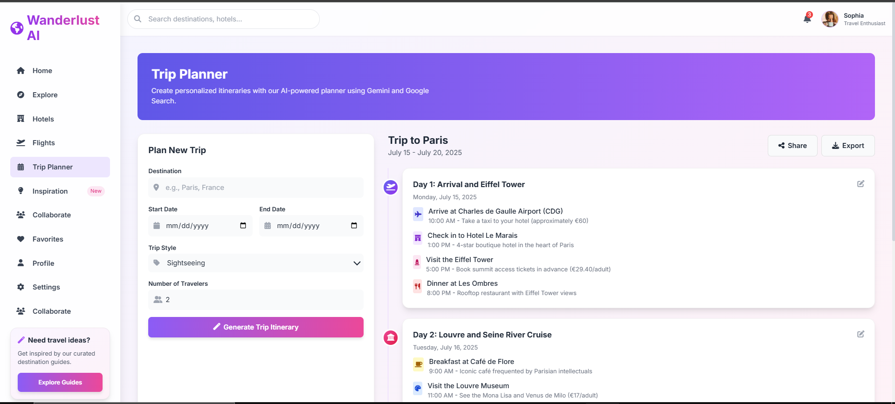

# 🌍 Wanderlust AI - Your Personal Travel Planner

<div align="center">





**AI-Powered Travel Planning Made Simple**

[](https://choosealicense.com/licenses/mit/)
[](https://github.com/benoualiabdelkader/Wanderlust-AI/stargazers)
[](https://github.com/benoualiabdelkader/Wanderlust-AI/issues)
[](https://github.com/benoualiabdelkader/Wanderlust-AI/pulls)
[](https://github.com/benoualiabdelkader/Wanderlust-AI/commits/main)

[🚀 **Live Demo**](https://benoualiabdelkader.github.io/Wanderlust-AI/) • [📚 **Documentation**](https://github.com/benoualiabdelkader/Wanderlust-AI/wiki) • [🐛 **Report Bug**](https://github.com/benoualiabdelkader/Wanderlust-AI/issues/new?assignees=&labels=bug&template=bug_report.md) • [💡 **Request Feature**](https://github.com/benoualiabdelkader/Wanderlust-AI/issues/new?assignees=&labels=enhancement&template=feature_request.md)

</div>

---

## 🚀 About The Project


**Wanderlust AI** is a cutting-edge, AI-powered travel planning web application that revolutionizes how you discover, plan, and manage your travel experiences. Built with modern web technologies and powered by Google's Gemini AI, it provides intelligent travel recommendations, seamless itinerary planning, and comprehensive travel management tools.

### ✨ What Makes It Special?

- 🤖 **Smart AI Assistant** - Get personalized travel recommendations powered by Google Gemini
- 🎯 **Intelligent Planning** - AI-driven itinerary suggestions based on your preferences  
- 🔍 **Rich Discovery** - Explore destinations with integrated videos and real-time information
- 📱 **Responsive Design** - Perfect experience across all devices
- ⚡ **Lightning Fast** - Optimized performance with modern web technologies

## 📋 Table of Contents

<details>
<summary>👆 Click to expand</summary>

- [🚀 About The Project](#-about-the-project)
- [✨ Features](#-features)
- [🛠 Built With](#-built-with)
- [🏁 Getting Started](#-getting-started)
  - [Prerequisites](#prerequisites)
  - [Installation](#installation)
- [🎮 Usage](#-usage)
- [📸 Screenshots](#-screenshots)
- [🗺 Roadmap](#-roadmap)
- [🤝 Contributing](#-contributing)
- [📄 License](#-license)
- [📞 Contact](#-contact)
- [🙏 Acknowledgements](#-acknowledgements)

</details>

## ✨ Features

<div align="center">
<table>
<tr>
<td width="50%">

### 🧠 AI-Powered Intelligence
- **Smart Recommendations** using Google Gemini API
- **Natural Language Processing** for conversational interactions
- **Personalized Suggestions** based on user preferences
- **Context-Aware Planning** with intelligent insights

</td>
<td width="50%">

### 🌐 Rich Travel Discovery
- **Destination Exploration** with detailed information
- **YouTube Integration** for travel videos and guides
- **Real-time Weather** data integration
- **High-quality Images** from Pexels API

</td>
</tr>
<tr>
<td width="50%">

### 📅 Comprehensive Planning Tools
- **Flight Search & Comparison** with multiple airlines
- **Hotel Booking** with advanced filtering options
- **Itinerary Builder** with drag-and-drop interface
- **Trip Collaboration** for group travel planning

</td>
<td width="50%">

### 🎨 Modern User Experience
- **Responsive Design** with Tailwind CSS
- **Dark/Light Theme** support
- **Smooth Animations** and transitions
- **Intuitive Navigation** with sidebar menu

</td>
</tr>
</table>
</div>

## 🛠 Built With

<div align="center">

[](https://developer.mozilla.org/en-US/docs/Web/HTML)
[](https://developer.mozilla.org/en-US/docs/Web/CSS)
[](https://developer.mozilla.org/en-US/docs/Web/JavaScript)
[](https://tailwindcss.com/)

</div>

### 🔧 Core Technologies
- **Frontend**: HTML5, CSS3, Vanilla JavaScript (ES6+)
- **Styling**: Tailwind CSS, Custom CSS Variables, Font Awesome Icons
- **Architecture**: Single Page Application (SPA) with modular components

### 🚀 API Integrations
- **Google Gemini API** - AI-powered travel recommendations
- **YouTube Data API** - Travel videos and destination content
- **Google Custom Search API** - Enhanced search capabilities
- **Pexels API** - High-quality travel photography
- **OpenWeatherMap API** - Real-time weather information

## 🏁 Getting Started

Get a local copy up and running with these simple steps!

### Prerequisites

Before you begin, ensure you have:
- A modern web browser (Chrome 90+, Firefox 88+, Safari 14+, Edge 90+)
- API keys for the integrated services (see [API Setup](#-api-setup))
- Basic knowledge of HTML, CSS, and JavaScript (optional, for customization)

### Installation

1. **Clone the repository**
   ```bash
   git clone https://github.com/benoualiabdelkader/Wanderlust-AI.git
   cd Wanderlust-AI
   ```

2. **Set up environment variables**
   
   Create a `.env` file in the root directory:
   ```env
   # Google APIs
   GEMINI_API_KEY=your_gemini_api_key_here
   YOUTUBE_API_KEY=your_youtube_api_key_here
   GOOGLE_SEARCH_API_KEY=your_google_search_api_key_here
   GOOGLE_SEARCH_ENGINE_ID=your_search_engine_id_here
   
   # Additional APIs
   PEXELS_API_KEY=your_pexels_api_key_here
   OPENWEATHER_API_KEY=your_openweather_api_key_here
   ```

3. **Start a local server**
   ```bash
   # Using Python 3
   python -m http.server 8000
   
   # Using Node.js
   npx http-server
   
   # Using PHP
   php -S localhost:8000
   ```

4. **Open in browser**
   ```
   http://localhost:8000
   ```

> 💡 **Pro Tip**: Use VS Code Live Server extension for the best development experience!

### 🔑 API Setup

<details>
<summary>🔐 Click to view detailed API setup instructions</summary>

#### Google Gemini API
1. Visit [Google AI Studio](https://aistudio.google.com/)
2. Create a new project or select existing one
3. Generate an API key
4. Add to your `.env` file

#### YouTube Data API
1. Go to [Google Cloud Console](https://console.cloud.google.com/)
2. Enable YouTube Data API v3
3. Create credentials (API key)
4. Add to your `.env` file

#### Google Custom Search API
1. Create a Custom Search Engine at [Google CSE](https://cse.google.com/)
2. Note your Search Engine ID
3. Enable Custom Search API in Google Cloud Console
4. Add both API key and Search Engine ID to `.env`

#### Pexels API
1. Sign up at [Pexels](https://www.pexels.com/api/)
2. Generate API key from dashboard
3. Add to your `.env` file

#### OpenWeatherMap API
1. Register at [OpenWeatherMap](https://openweathermap.org/api)
2. Get your free API key
3. Add to your `.env` file

</details>

## 🎮 Usage

### 🏠 Home Page
- Chat with the AI assistant for travel recommendations
- Quick access to all major features
- View your recent activity and saved favorites

### 🔍 Explore Destinations  
- Browse popular travel destinations
- Watch destination videos from YouTube
- Get detailed information about places

### ✈️ Flight & Hotel Booking
- Search and compare flights from multiple airlines
- Find hotels with advanced filtering options
- Real-time pricing and availability

### 📅 Trip Planning
- Create detailed itineraries with AI assistance
- Collaborate with friends and family
- Organize activities and reservations


<details>
<summary>📱 View Mobile Screenshots</summary>

<div align="center">

</div>

</details>

## 🗺 Roadmap

- [x] **Phase 1**: Core AI Integration
  - [x] Google Gemini API integration
  - [x] Basic chat interface
  - [x] Travel recommendations engine

- [x] **Phase 2**: Travel Services
  - [x] Flight search functionality  
  - [x] Hotel booking system
  - [x] Destination exploration

- [ ] **Phase 3**: Advanced Features
  - [ ] Real-time booking integration
  - [ ] Social sharing capabilities
  - [ ] Offline mode support

- [ ] **Phase 4**: Mobile & Enhancement
  - [ ] Progressive Web App (PWA)
  - [ ] Mobile app development
  - [ ] Advanced AI features

See the [open issues](https://github.com/benoualiabdelkader/Wanderlust-AI/issues) for a full list of proposed features and known issues.

## 🤝 Contributing

Contributions make the open source community an amazing place to learn, inspire, and create. Any contributions you make are **greatly appreciated**!

<div align="center">

[](https://github.com/benoualiabdelkader/Wanderlust-AI/graphs/contributors)

</div>

### How to Contribute

1. **Fork the Project**
2. **Create your Feature Branch** (`git checkout -b feature/AmazingFeature`)
3. **Commit your Changes** (`git commit -m 'Add some AmazingFeature'`)
4. **Push to the Branch** (`git push origin feature/AmazingFeature`)
5. **Open a Pull Request**

### 🐛 Found a Bug?

1. Check if it's already reported in [Issues](https://github.com/benoualiabdelkader/Wanderlust-AI/issues)
2. If not, [create a new issue](https://github.com/benoualiabdelkader/Wanderlust-AI/issues/new?template=bug_report.md)
3. Provide detailed information about the bug

### 💡 Have a Feature Idea?

1. [Create a feature request](https://github.com/benoualiabdelkader/Wanderlust-AI/issues/new?template=feature_request.md)
2. Describe your idea in detail
3. Explain why it would be beneficial

### 📝 Development Guidelines

- Follow the existing code style and structure
- Write clear, readable code with comments
- Test your changes thoroughly
- Update documentation as needed
- Ensure mobile responsiveness

## 📄 License

Distributed under the MIT License. See `LICENSE` for more information.

<details>
<summary>📋 License Details</summary>

```
MIT License

Copyright (c) 2024 Abdelkader Benouali

Permission is hereby granted, free of charge, to any person obtaining a copy
of this software and associated documentation files (the "Software"), to deal
in the Software without restriction, including without limitation the rights
to use, copy, modify, merge, publish, distribute, sublicense, and/or sell
copies of the Software, and to permit persons to whom the Software is
furnished to do so, subject to the following conditions:

The above copyright notice and this permission notice shall be included in all
copies or substantial portions of the Software.

THE SOFTWARE IS PROVIDED "AS IS", WITHOUT WARRANTY OF ANY KIND, EXPRESS OR
IMPLIED, INCLUDING BUT NOT LIMITED TO THE WARRANTIES OF MERCHANTABILITY,
FITNESS FOR A PARTICULAR PURPOSE AND NONINFRINGEMENT. IN NO EVENT SHALL THE
AUTHORS OR COPYRIGHT HOLDERS BE LIABLE FOR ANY CLAIM, DAMAGES OR OTHER
LIABILITY, WHETHER IN AN ACTION OF CONTRACT, TORT OR OTHERWISE, ARISING FROM,
OUT OF OR IN CONNECTION WITH THE SOFTWARE OR THE USE OR OTHER DEALINGS IN THE
SOFTWARE.
```

</details>

## 📞 Contact

<div align="center">

**Abdelkader Benouali** - *Project Creator & Maintainer*

[](https://github.com/benoualiabdelkader)
[](https://linkedin.com/in/benoualiabdelkader)
[](mailto:benoualiabdelkader@example.com)
[](https://benoualiabdelkader.github.io)

**Project Link**: [https://github.com/benoualiabdelkader/Wanderlust-AI](https://github.com/benoualiabdelkader/Wanderlust-AI)

</div>

## 🙏 Acknowledgements

<div align="center">

Special thanks to these amazing resources and communities:

</div>

- [Google AI](https://ai.google.dev/) - For the powerful Gemini API
- [Tailwind CSS](https://tailwindcss.com/) - For the utility-first CSS framework
- [Font Awesome](https://fontawesome.com/) - For the comprehensive icon library
- [Pexels](https://www.pexels.com/) - For beautiful, free travel photography
- [OpenWeatherMap](https://openweathermap.org/) - For reliable weather data
- [YouTube API](https://developers.google.com/youtube/) - For video content integration
- [GitHub](https://github.com/) - For hosting and version control
- [MDN Web Docs](https://developer.mozilla.org/) - For excellent documentation
- [Stack Overflow](https://stackoverflow.com/) - For community support
- All the amazing [contributors](https://github.com/benoualiabdelkader/Wanderlust-AI/graphs/contributors) who helped improve this project

---

<div align="center">

### 🌟 Show Your Support

If this project helped you, please consider:

[](https://github.com/benoualiabdelkader/Wanderlust-AI/stargazers)
[](https://github.com/benoualiabdelkader/Wanderlust-AI/fork)
[](https://twitter.com/intent/tweet?text=Check%20out%20this%20amazing%20AI-powered%20travel%20planner!&url=https://github.com/benoualiabdelkader/Wanderlust-AI)

### 📊 Project Stats


**Made with ❤️ and lots of ☕**

*Happy Traveling! ✈️🏨🗺️*

</div>
